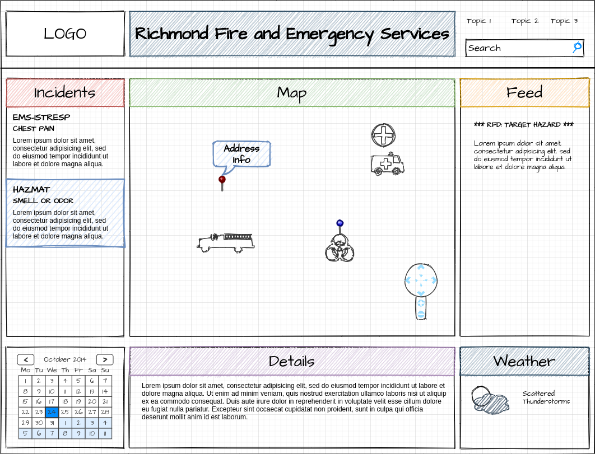
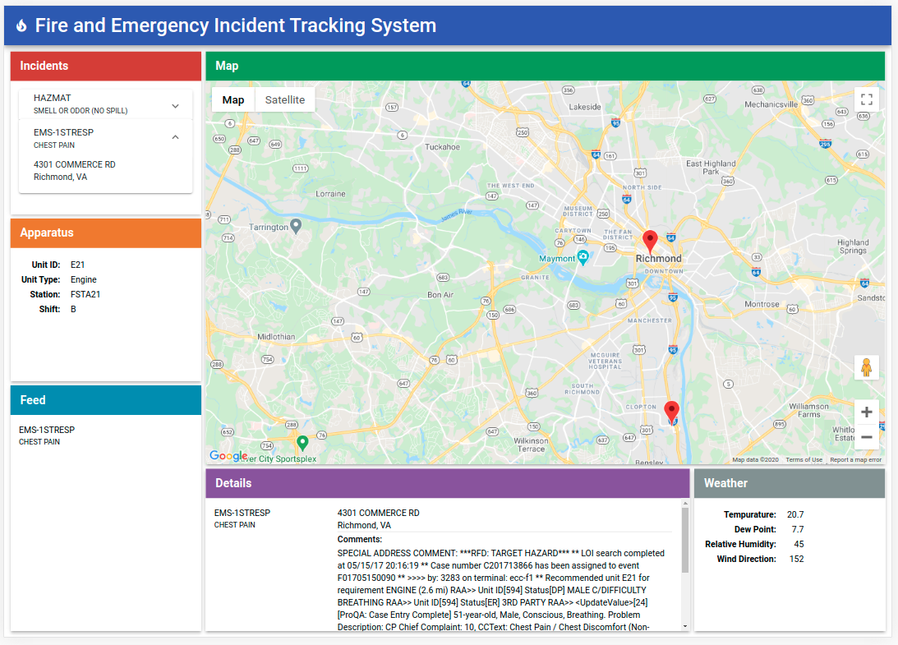

# Fire and Emergency Incident Tracking System

This TypeScript Monorepo includes an API server in NestJS, an Angular/Material Web App, and a Shared Library of classes common to both the API and Web App.

#

## Web App Mockup
My initial UI/UX design presented the user with a "Dashboard" Grid Layout with 6 tiles. Although the tiles resize with the browser, I didn't take the extra time required to make the layout mobile-friendly. With the amount of information to display as well as the size requirements of the map, this app really requires a tablet or desktop display -- mobile navigation would most-likely be problematic.



I created the mockup with the [Draw.io Visual Studio Code extension](https://marketplace.visualstudio.com/items?itemName=hediet.vscode-drawio), which I also added to the recommended extensions in the `.vscode` directory. The `Mockup.drawio` source file is in the assets directory of the API app.

#

## Installation Instructions
As a full-stack TypeScript/Node.js app, the only prerequisites are the latest LTS (or stable) version of Node and NPM or Yarn.

### Clone the repository:
```
$ git clone https://github.com/KCCloudTech/fullstack-incident-tracking-system.git
```

### Install the dependencies:
```
$ cd ./fullstack-incident-tracking-system
$ npm i
```
Or, if you prefer...
```
$ yarn
```


## Running the Full-Stack App
Once the dependencies are installed, you can launch the NestJS API server on port 3333, and serve the static Angular site on port 4200. For development, the Angular static web host provides an HTTP Proxy to port 3333, so you don't have to deal with CORS issues. For example, http://localhost:4200/api/incidents will pass through to http://localhost:3333/api/incidents.

### Launching the API Server
Before running the API Server, you need to set your meteostat.net API key in the environment files. Then, from the project root, execute the following command in your OS shell:
```
$ nx serve api
```
Once the project builds, you should see something like the following:
```
[Nest] [NestFactory] Starting Nest application...
[Nest] [InstanceLoader] AppModule dependencies initialized +18ms
[Nest] [RoutesResolver] AppController {/api/incidents}: +11ms
[Nest] [RouterExplorer] Mapped {/api/incidents, GET} route +3ms
[Nest] [RouterExplorer] Mapped {/api/incidents/:key, GET} route +2ms
[Nest] [NestApplication] Nest application successfully started +3ms
[Nest] Listening at http://localhost:3333/api +3ms
No type errors found
Version: typescript 4.0.3
Time: 4159ms
```

If you point your browser to either of the following URLs, you should see the JSON response enriched with the weather data:

http://localhost:3333/api/incidents/F01705150050


http://localhost:3333/api/incidents/F01705150090


### Serving the static Web App
Before serving the web app, you need to set your Google Maps API key in the `index.html` file. Then, from the project root, execute the following command in a new OS shell tab/window:
```
$ nx serve dashboard -o
```
Or simply...
```
$ nx serve -o
```
The Angular web app should launch in your default browser once the build is complete. You should see something like the following:



## Missing Features
I had planned to show the vehicles for the selected incident on the map as well as in the Apparatus list. Also, I planned for the Feed panel to display the `unit_status` status updates for the selected vehicle (sorted by timestamp). If I would have made it that far, then the final step would have been to show the vehicle's location for each status update. Using the material design GoogleMap component cost a little time trying to figure out to select markers.

All in all, this was an excellent exercise and one I wish I had more time to polish before submitting it for review.
